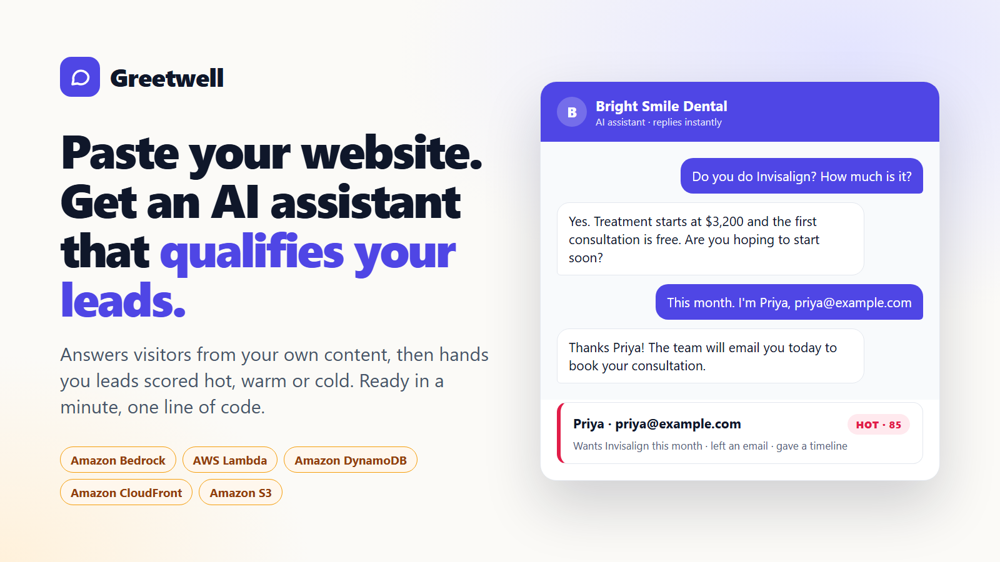

# Greetwell



Paste a website address. About a minute later you have an AI chat assistant that answers visitors from that site's own content, qualifies them, and hands the owner leads scored hot, warm or cold.

Built for the AWS **Zero to Shipped** hackathon. Category: `#commercial-potential`. Lane: `#startups`.

## What it does

1. **Learns the business.** A background worker reads the home page and up to seven of the most informative linked pages (pricing, services, about, FAQ, contact), strips navigation and boilerplate, and asks Claude on Amazon Bedrock for a structured profile: what the business offers, who it serves, and the three or four questions that separate a serious enquiry from a casual one.
2. **Answers visitors.** A one-line script tag puts a chat widget on any site. The assistant answers only from the business's content and the owner's notes, says so when it doesn't know, and replies in the visitor's language.
3. **Qualifies leads.** When a visitor shares what they need and how to reach them, the model calls a `save_lead` tool. The server validates the contact details and computes a transparent 0-100 score from intent, timeline, budget and reachability.
4. **Hands them over.** The owner's dashboard lists leads with the reasons behind each score and the full transcript, tracks status, exports CSV, and can push every new lead to Slack, Zapier or a CRM through a webhook.

There is no signup. Creating an assistant returns a private dashboard link whose secret lives in the URL fragment, so it is never sent to a server log.

## Architecture

```
                    ┌──────────────────────── CloudFront ────────────────────────┐
 visitor's browser  │  /            /widget.js          │  /api/*                │
 (any website) ────►│  S3 (private, OAC)                │  adds X-Origin-Verify  │
                    └───────────────────────────────────┴───────────┬────────────┘
                                                                    ▼
                                                        API Gateway (HTTP API)
                                                                    ▼
                                           Lambda: API  ──async──► Lambda: builder
                                            │    │    │              │   │    │
                                   DynamoDB ◄    │    └► Bedrock ◄───┘   │    └► public web
                                  (one table)    ▼      (Claude)         ▼      (guarded fetch)
                                                 S3 knowledge bases ◄────┘
```

| Piece | Service | Notes |
|---|---|---|
| Site, widget, CDN | CloudFront + S3 | Bucket is private; CloudFront reads it with Origin Access Control |
| API | API Gateway HTTP API + Lambda (Python 3.13) | Only reachable through CloudFront (shared-secret origin header) |
| Site reader | Lambda, invoked asynchronously | Keeps the create request instant; dashboard polls for progress |
| Data | DynamoDB, single table, on-demand | Assistants, conversations (45-day TTL), leads, rate-limit counters |
| Knowledge bases | S3 | One JSON document per assistant |
| Model | Claude on Amazon Bedrock | Anthropic SDK's Bedrock client, signed with the Lambda's IAM role |

Everything is defined in [template.yaml](template.yaml) and deployed by one script.

### Design decisions worth knowing

- **No vector database.** Small-business sites are small. A knowledge base under 30k characters goes into the prompt whole, behind a prompt-cache breakpoint, which is both the most accurate option and the cheapest after the first message. Larger sites are narrowed per question with BM25 computed inside the Lambda. See [knowledge.py](backend/app/knowledge.py).
- **The model proposes, the server decides.** The model reports what the visitor said and how ready they seem. The server validates email and phone, refuses to save a lead with no way to reach the person, and computes the score itself so it is explainable and cannot be inflated. See [chat.py](backend/app/chat.py).
- **Fetching user-supplied addresses safely.** The reader resolves the hostname itself, refuses any address that is not publicly routable, and connects to the exact IP it checked, which closes both plain SSRF and DNS rebinding. It respects `robots.txt` and identifies itself. See [crawl.py](backend/app/crawl.py).
- **A public endpoint with a hard budget.** There is no login, so every path to the model is capped: per visitor, per conversation, per assistant, and a global daily ceiling, all enforced with atomic DynamoDB counters.
- **It ships even if model access differs.** If the account cannot use the configured model, the app moves down a fallback chain at run time and stays there.

## Run it locally

No AWS account needed. Storage is in memory and the model is a rule-based stand-in, which is enough to work on the interface and the request flow.

```powershell
python -m venv .venv
.\.venv\Scripts\python.exe -m pip install "anthropic[bedrock]"
.\.venv\Scripts\python.exe scripts\local_server.py      # http://localhost:8000
```

Run the tests (standard library only):

```powershell
.\.venv\Scripts\python.exe -m unittest discover -s tests -v
```

## Deploy

Prerequisites: an AWS account, the AWS CLI v2 signed in (`aws configure` or `aws login`), and Python 3.10+.

```powershell
.\deploy.ps1                                  # us-east-1 by default
.\deploy.ps1 -AlertEmail you@example.com      # also email you if monthly spend passes $40
```

The script checks the connection, reports which Claude models the account can call, builds the Lambda package with Linux wheels, deploys the stack, uploads the site, seeds the demo assistant on the landing page, and then probes the live URL, including a real model reply. It ends by printing the live URL and writing `docs/proof/aws-connection.txt`.

To remove everything: empty the two buckets, then `aws cloudformation delete-stack --stack-name greetwell`.

## Configuration

Stack parameters (pass with `--parameter-overrides`, or edit the defaults in the template):

| Parameter | Default | Meaning |
|---|---|---|
| `ModelId` | `anthropic.claude-opus-5-5` | Model for conversations and profiles |
| `ModelFallbacks` | `anthropic.claude-opus-4-8,anthropic.claude-haiku-4-5` | Tried in order if the account has no access to `ModelId` |
| `DailyModelCallCap` | 600 | Ceiling on chat model calls per day, all assistants |
| `DailyMessagesPerAssistant` | 300 | Visitor messages per assistant per day |
| `DailyNewAssistants` | 60 | New assistants per day (each visitor IP is limited to 6) |
| `AlertEmail` | empty | If set, creates an AWS Budget alert at 80% of `MonthlyBudgetUsd` |

**Cost.** With no traffic the stack costs close to nothing: everything is on-demand. Model usage is the only meaningful cost, and the caps above bound it. `ModelId=anthropic.claude-haiku-4-5` is the low-cost setting.

## Project layout

```
backend/app/     handler.py (API)  builder.py (worker)  bots.py  chat.py
                 crawl.py  knowledge.py  llm.py  store.py  limits.py
web/             index.html  dashboard.html  preview.html  widget.js  assets/
scripts/         local_server.py  check_bedrock.py
tests/           test_app.py
template.yaml    deploy.ps1
```

## Known limits

- Sites that render all their content with JavaScript can't be read; the owner is told and can describe the business in a text box instead.
- The dashboard link is the only credential. Accounts with sign-in are the first thing on the roadmap.
- Replies are not streamed; the widget shows a typing indicator while the model answers.
